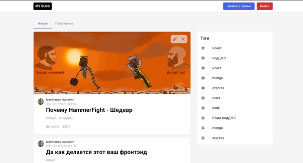
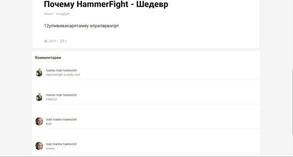

## Mern-Blog-App: Блог.

## Backend:
- Все данные хранятся в базе данных *MongoDB*
- Backend написан на Node.js, для его сообщения с сервером используется *Express*, для сообщения с базой данных *Mongoose*
- Изображения для аватаров пользователей и самих постов загружаются с помощью библиотеки *Multer*
- Пароли пользователей зашифрованы посредством *JWT* и *BCrypt*

## Frontend:
- Основа фронтэнда была сделана с помощью Create React App(https://github.com/facebook/create-react-app)
- Для отправки запросов на сервер используется *Axios*
- Контроль данных был реализован с помощью *Redux Toolkit*
- В верске использоваласть библиотека *MUI*

## Особенности:
- Регистрация осуществляется с помощью электронной почты и пароля, валидация происходит на стороне Backend
- Авторизованные пользователи могут создавать посты и комментировать их
- Реализован поиск постов по тэгам

